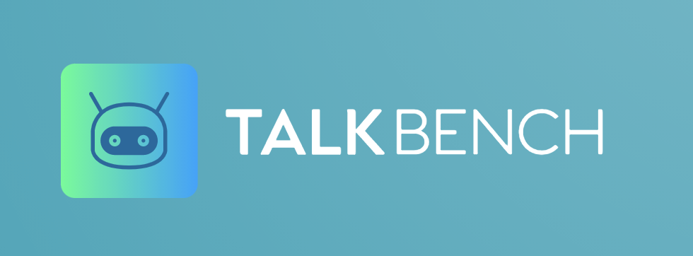

# TalkBench



TalkBench is a web site made in a group project created by a team that seeks to connect all those people who are thinking about changing their career, it is a place to talk and connect, to ask for advice and to read about useful information that can help you make the decision to start programming, one of the best things to learn nowadays! 

### Build with

This web is based on Spring, PostgreSQL, React, React router and Axios. Check the following links for documentation and guides:

- [Spring](https://spring.io/projects/spring-boot)
- [PostgreSQL](https://www.postgresql.org)
- [React](https://reactjs.org)
- [React Router](https://reacttraining.com/react-router/web/guides/quick-start)
- [Axios](https://github.com/axios/axios)

### Designed with 

- [Material-ui](https://material-ui.com/)
- [Sketch](https://www.sketch.com/)

### Dev Dependencies

  - Prettier
  - Webpack
  - Babel
  - ESLint
  - React
  - React-DOM

## Setup
Our development environment for a full-stack web application will consist of three main parts:

1. Database (Postgres).
2. Backend server (Spring).
3. Frontend development server (React).

### Prerequisites
- `docker` and `docker-compose`.
- `nodejs`.

### Starting the database
In the root folder, run
```
docker-compose up
```

### Starting the backend server
Open the root folder and run
```
./gradlew bootRun
```

### Starting the frontend development server
The frontend application is in the directory `frontend`. From there, run 
```
npm install
```
to install all the dependencies needed for the project.

Then start the frontend application by running
```
npm start
```

## About the project:  

This project is done during the Backend Development Module of the KTH Software Development Academy.

## About the team

We are a team of junior developers studying at the KTH software development academy. 
